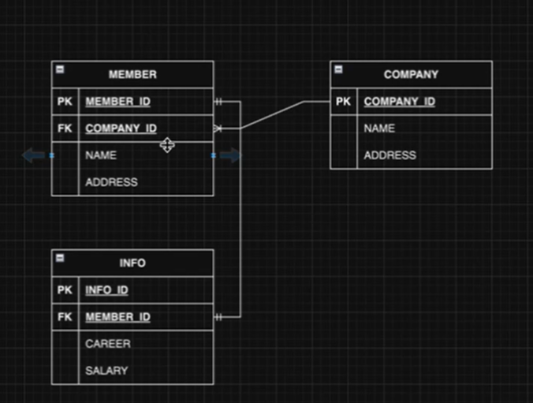

# company 프로젝트 기획서
- - -
## 1. 프로젝트 개요

- - -
### 1.2목적
JPA프로젝트를 들어가기 전 모의로 깃허브 관리, 지금까지 배운내용을 응용하기 위해 복습하는 의미에서 진행하는 프로젝트 입니다.

### 1.2 프로젝트 명
company

### 2. 주요기능
#### 2.1.1 Member 등록
- 해당 Member에 대한 등록기능
#### 2.1.2 Member 조회
- 해당 Member에 대한 조회기능
#### 2.1.3 Member 수정
- 해당 Member에 대한 수정기능
#### 2.1.4 Member 삭제
- 해당 Member에 대한 삭제기능

#### 2.2.1 company 등록
- 해당 company에 대한 등록기능
#### 2.2.2 company 조회
- 해당 company에 대한 조회기능
#### 2.2.3 company 수정
- 해당 company에 대한 수정기능
#### 2.2.4 company 삭제
- 해당 company에 대한 삭제기능

#### 2.3.1 INFO 등록
- 해당 INFO에 대한 등록기능
#### 2.3.2 INFO 조회
- 해당 INFO에 대한 조회기능
#### 2.3.3 INFO 수정
- 해당 INFO에 대한 수정기능
#### 2.3.4 INFO 삭제
- 해당 INFO에 대한 삭제기능

## 2. 작업 기간
- 4월 26일 ~ 5월 4일

## 3. 기술 스택
- backend
    - Java17
    - SpringBoot 3.2.5
    - JPA
    - QueryDSL
- Frontend
  - Thymeleaf
  - HTML
  - CSS
  - JAVASCRIPT
  - jQuery
- DataBase
  - H2